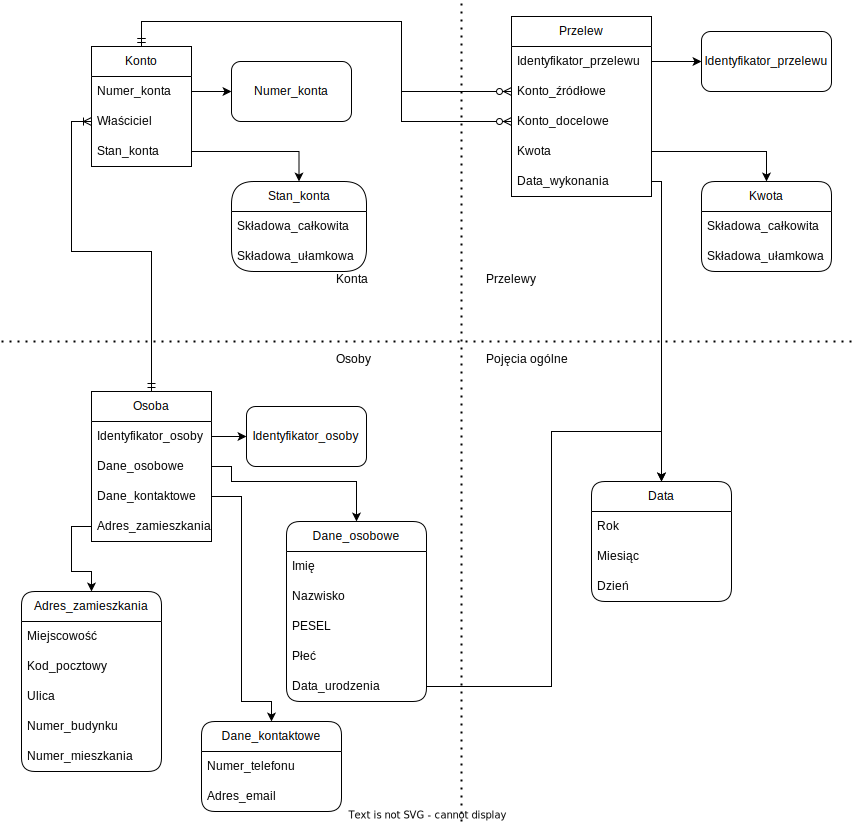

Konteksty zostały oddzielone kropkowaną linią. Obiekty znajdujące się w kontekście "Pojęcia ogólne" są zdefiniowane dla całego systemu.   
Encje zostały oznaczone prostokątami z ostrymi wierzchołkami, a obiekty wartości - prostokątami z zaokrąglonymi brzegami.  
Atrybuty encji/obiektów wartości, które same są encjami/obiektami wartościami, są połączone strzałką z odpowiednim obiektem.

| Kontekst       | Encja/Obiekt wartość | Atrybut                 | Opis                                            |
|----------------|----------------------|-------------------------|-------------------------------------------------|
| Pojęcia ogólne | Data                 | Rok                     | Liczba całkowita z zakresu [1900; 2200]          |
|                |                      | Miesiąc                 | Liczba całkowita z zakresu [1; 12]               |
|                |                      | Dzień                   | Liczba całkowita z zakresu [1; *x*].  Zazwyczaj *x* jest wartością z tabeli [31, 28, 31, 30, 31, 30, 31, 31, 30, 31, 30, 31] na pozycji wskazanej przez *Miesiąc*.  Wyjątkiem jest sytuacja, w której *Rok* jest przestępny, a *Miesiąc* jest równy 2, wtedy *x* wynosi 29. |
| Osoby           | Osoba               | Identyfikator_osoby     | Ciąg znaków składający się z 8 cyfr.  Musi być różny od wszystkich, już istniejących *identyfikatorów_osób*.  |
|                 | Dane_osobowe        | Imię                    | Ciąg znaków składający się z [3-20] liter       |
|                 |                     | Nazwisko                | Ciąg znaków składający się z [3-20] liter       |
|                 |                     | PESEL                   | Ciąg znaków składający się z 11 cyfr            |
|                 |                     | Płeć                    | Jedna z wartości {'m', 'f', 'o'}                |
|                 | Dane_kontaktowe     | Numer_telefonu          | Ciąg znaków składający się z 11 cyfr. 2 pierwsze to numer kierunkowy, a pozostałe 9 - numer właściwy  |
|                 |                     | Adres_email             | Ciąg maksymalnie 255 znaków składający się z liter, cyfr, znaków {'+', '-', '_', '~'}.  Musi zawierać pojedynczy znak '@'.|
|                 | Adres_zamieszkania  | Miejscowość             | Ciąg [2-30] znaków składający się z liter i znaków {' ', '.', '-'}  |
|                 |                     | Kod_pocztowy            | Ciąg znaków składająćy się z 2 cyfr, znaku '-' i 3 kolejnych cyfr  |
|                 |                     | Ulica                   | Ciąg [2-30] znaków składający się z liter i znaków {' ', '.', '-'}, może być pusty |
|                 |                     | Numer_budynku           | Ciąg znaków składający się z [1-3] cyfr, po cyfrach może znajdować się pojedyncza litera  |
|                 |                     | Numer_mieszkania        | Ciąg znaków składający się z [1-3] cyfr, po cyfrach może znajdować się pojedyncza litera, może być pusty  |
| Konta           | Konto               | Numer_konta             | Ciąg znaków składający się z 26 cyfr.  Musi być różny od wszystkich, już istniejących *Numerów_kont*.|
|                 |                     | Właściciel              | *Identyfikator_osoby* przypisany do właściciela konta  |
|                 | Stan_konta          | Składowa_całkowita      | Liczba całkowita z zakresu [-1000; 1000000]  |
|                 |                     | Składowa_ułamkowa       | Liczba całkowita z zakresu [-99: 99]  |
| Przelewy        | Przelew             | Identyfikator_przelewu  | Ciąg znaków składający się z 32 cyfr.  Musi być różny od wszystkich, już istniejących *identyfikatorów_przelewów*.|
|                 |                     | Konto_źródłowe          | *Numer_konta* przypisany do konta, z którego pobrana została *Kwota*  |
|                 |                     | Konto_docelowe          | *Numer_konta* przypisany do konta, na które przekazana została *Kwota*  |
|                 | Kwota               | Składowa_całkowita      | Liczba całkowita z zakresu [0; 100000]  |
|                 |                     | Składowa_ułamkowa       | Liczba całkowita z zakresu [0: 99]  |